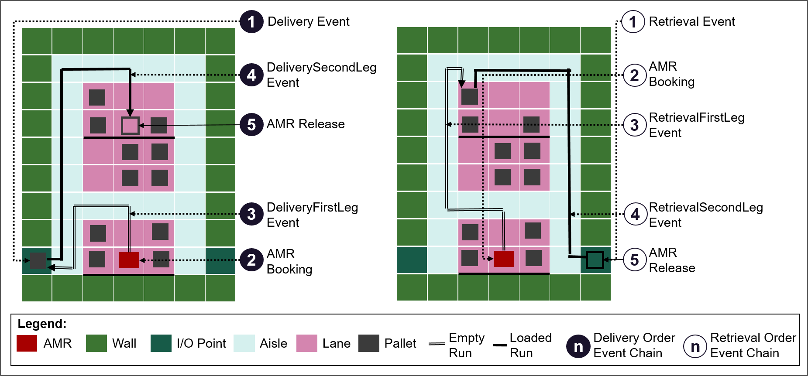
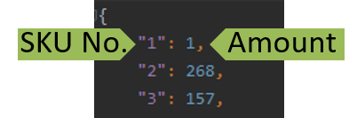
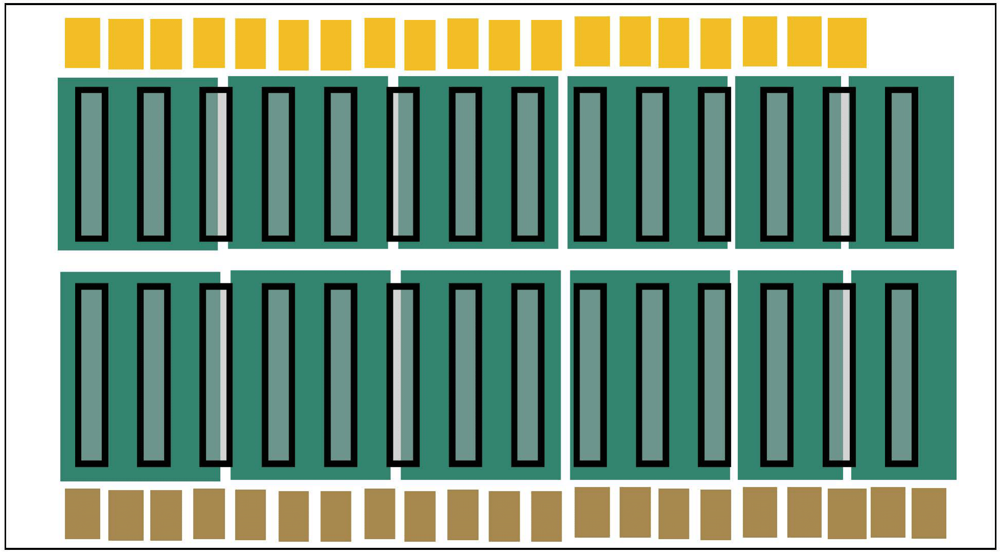
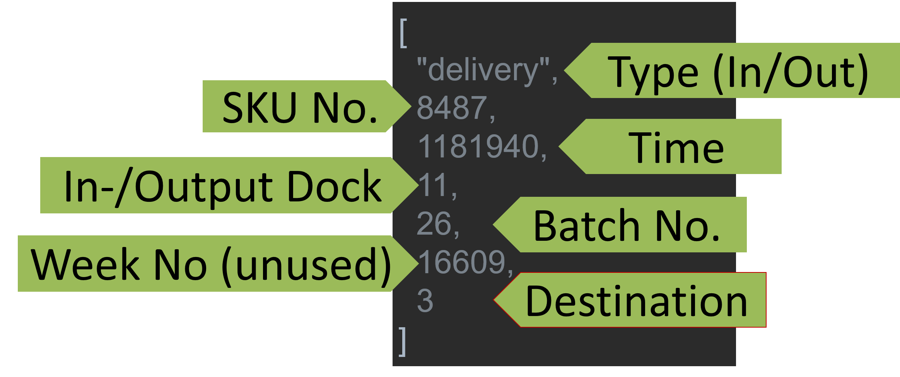

# SLAPStack 
SLAPStack is a block-stacking warehouse simulation for the Autonomous Block 
Stacking Warehouse Problem (ABSWP) [[1]](#pfrommer2020) implementing the 
[OpenAI](https://gym.openai.com/) gym interface. 
The code can be used to test out Storage Location Allocation Problem (SLAP) and 
Unit Load Selection Problem (ULSP) algorithms individually or in conjunction. 

The simulation project includes the `WEPAStacks` data which includes the layout 
and 3 months of order information of a large-scale real-world clock stacking 
warehouse from [WEPA Hygieneprodukte GmbH](https://www.wepa.eu/de/).
Additionally, an anonymized use case dataset, `CrossStacks` associated with a 
medium-sized cross-docking terminal is made available. `CrossStacks` 

## SLAPStack Simulation
### Architecture

The project architecture follows the one introduced in [[2]](#rinciog2020), 
as can be seen in the partial class diagram below. The simulation entry point, 
which implements the gym interface is located in the `SlapEnv` class located in 
the `interface.py` module. `SlapEnv`, whose primary function is action- and 
state-space configuration and transformation, is a wrapper around the `SlapCore`
which contains the simulation logic. 

`SlapCore` is responsible for advancing the simulation when calling `step`. It 
uses an `EventManager` object to maintain the `Event` queues. The central 
SLAPStack communication structure is given by the `State` object contained by 
the `SlapCore`.  

The `State` contains several manager objects dedicated to distinct tasks. 
The `RouteManager`, for instance, is used to compute routes on the storage 
matrix `S` grid during `Transport` event initialization. The 3D state matrices 
`S`  (pallet SKUs information), `V` (vehicle positions), 
`B` (pallet batch information), and `T` (pallet arrival information) are shared 
between `State` and manager objects as needed (e.g. `V` is shared between 
`AmrManager` and `State`). 

The `interface_templates.py` module defines and documents the simulation 
parameter as well as the `SlapEnv` configuration objects, i.e. `Strategy` for 
allowing indirect actions and `OutputConverter` for transforming both the state 
representation and the reward returned by `SlapEnv.step()`.

<p align="center">
	
</p>


### Events
At the core of the simulation lies the `future_events` queue. `future_events` is 
a time-sorted heap of self-handling events. During a simulation step, events are 
popped from this heap and their handle function is called leading to a state 
update. If a triggered event requires an external ULSP or SLAP decision, the 
execution halts, and the state is returned.
Events are either orders or transport events. Orders (`Delivery` or `Retrieval`) 
get added to the queue during initialization. Transport events 
(`Delivery/RetrievalFirst/SecondLeg`) are created on-demand. Of the 6 events 
present in the simulation, 2 are blocking, namely `Retrieval` and 
`DeliverySecondLeg`. The relationship between them is depicted event chain 
summary below.

<p align="center">
	
</p>


### Routing and Runtime

The design lain down in [[2]](#rinciog2020) and implemented by SLAPStack leads 
to an efficient runtime in terms of event management and state updates. 
All state updates are run in constant or amortized constant time. 
Since, `future_events` is a binary heap, pushing `Order` events to it during 
initialization and  `Transport` events to it during `step` takes logarithmic 
time with respect to the total number of orders. This yields an asymptotic 
runtime of O(n log(n)), where n is the number of orders.

However, a particularity of SLAPStack is the fine-grained routing mechanism 
implemented. Whenever a `Transport` event is created, the exact closest grid 
cell route between the AMRs current position and its destination is computed. 
Dijkstra takes O(m log(m + l)) where m is the number of nodes and l is the 
number of edges in the routing graph. In our case, that would amount to 
O(m log m) with m being the number of grid cells in the BSWP (each grid cell is 
a routing graph node and each cell has four bidirectional edges, 
i.e. O(m log(m + l) = O(m log(m + 4m)) = O(m log(m)). 
To deal with this routing bottleneck, SLAPStack's `RouteManager` precomputes 
all routes over aisle tiles (the light blue tiles in the figure below) using 
the Floyed Warshall algorithm implemented in `scipy`. The exact route 
computation is then completed by adding lane traversal segments which runs in 
constant time (see figure).

Simulating a total of 400000 orders on CPU take around 1 hour.

<p align="center">
	
</p>

### Extensions

The latest version of this simulation contains extensions necessary to 
accommodate cross-docking use-cases and dual command cycle heuristics. These 
extensions are:
* dock to dock transports
* order queueing on AMRs

Additionally, AMRs are capable or transporting more than one load at a time 
(multiple forks).  

## Use Case Data

### WEPAStacks 

This dataset is based on a real-world block stacking warehouse from WEPA.

WEPA is one of the largest hygienic paper manufacturers in Europe with 
production plants and warehouses in currently six European countries 
(www.wepa.eu).

The dataset consists of three components:

1. the warehouse layout
2. the initial fill level
3. the order stream

#### Warehouse Layout

The grid-based warehouse layout shown in the figure below is used to store 
finished goods on standardized EUR-pallets that can be stacked up to 3 levels. 
The capacity of the warehouse is up to 19512 storage locations (6504 on the 
ground with stacking). The light-gray area shows the bidirectional pathways 
(aisles). Dependent on the type of vehicle they are double/three-lanes wide. 
The storage bays/lanes are the white areas with separating lines. The dark-gray 
surrounding wall and truck loading zone define the boundaries of the storage 
system. Interfaces to the outside world are 4 Inputs (I-points) that represent 
the production lines and 10 Outputs (O-points) for shipping. At I-points the 
delivered pallets are picked up and transported to a storage location. Upon the 
arrival of a retrieval order, pallets are provided at the O-points. O-points are
the staging areas in front of the dock doors. The truck loading process is not 
part of the use-case since it is executed by the truck drivers.

The warehouse layout is provided as csv-file with numbers from -5 to 0. A -5 
represents a travel path, -4 an O-point, -3 an I-point, -2 an aisle, -1 the 
warehouse boundaries and 0 the available storage locations.

<p align="center">
	
</p>

#### Initial fill level

The initial fill level is a dictionary of Stock Keeping Unit (SKUs) with the 
respective amount currently on stock at time zero. 

<p align="center">
	
</p>

#### Order stream

The order stream represents the daily in- and outbound flow with the exact 
arrival times of each delivery or retrieval order for a time period of 89 days 
(amounting to 4e5 orderes). Each order corresponds to a single pallet. 
While the inbound flow is based on a production frequency of 60 to 120 seconds, 
the outbound flow is mainly in full truck loads (FTL) with 33 pallets.

The orders are provided as a nested list. Each order comes with six parameters 
namely the type (delivery or retrieval), the SKU (number from 1 to 136), 
the order arrival time (absolute time in seconds counting from zero), 
the dock door (number from 1 to 4 from top to bottom for delivery and 1 to 10 
from left to right for retrieval), the batch number (number of production 
batches from 1 to 1498 for delivery and of truckload batches from 1 to 7496 
for retrieval) and the week number (from 1 to 14).

<p align="center">
	
</p>

### CrossStacks
`CROSSStacks`, that was constructed based on two weeks of orders of a 
medium-sized, manually operated cross-docking terminal for food industry goods 
run by a large freight company. The data we provide was gathered with the help 
of a process mining company focusing on increasing the transparency of (manual) 
industrial processes without revealing any sensitive customer information.

As opposed to `WEPAStacks` the `CrossStacks` dataset consists of only two 
components, bacause the warehouse is empty at the beginning of a new day.

1. the warehouse layout
3. the order stream

#### Layout

The figure below depicts an overlay of the warehouse layout and storage regions 
tracked by the process mining company.
Yellow boxes represent inbound docks, brown boxes represent outboutnd docks.
The storage bays are represented by empty black rectangles.
The green-filled rectangles represent the storage regions tracked by the process
mining company.
Within the current use case stacking is not allowed.

<p align="center">
	
</p>

#### Order Stream
Cross-docking orders contain add a sixth field, namely the destination dock, to 
the structure previously described (cmp. figure below). 
This field is only relevant for delivery orders. 

The destination field was unavailable to us in an explicit form and needed to be 
inferred from the data. 
To that end, we used the motion tracking information together with a FIFO 
assumption to extract the destination dock of inbound orders: We aligned the 
orders entering and exiting the green storage regions in the layout figures 
using tracking timestamps and assigned the outbound docks to the corresponding 
inbound orders.

<p align="center">
	
</p>


## Getting Started
### Installation
We publish this project alongside our experiment script and a control package containing various SLAP heuristics as well as a ULSP heuristic. To set up your environment and recreate our experiment results, the following steps can be taken:
1. Cloning the repository:
	```
	git clone https://github.com/malerinc/slapstack.git
	```
2. To install the SLAPStack simulation and its controls run the following commands from the project root directory (this will build the Cython extensions and copy the use case data at the appropriate locations):
	```
	pip install 1_environment/slapstack
	pip install 2_control/slapstack-controls
	```
3. To run the experiment script, simply execute the `cmp` scripts located in the 
experiments directory directly under the root:
	```
   python slap_strategy_cmp_crossstacks.py
   python slap_strategy_cmp_wepastacks.py
   ```

Note that both the `slapstack` and `slapstack-controls` packages are available 
through pypi as well. To install from pypi, simply run

```
pip install slapstack
pip install slapstack-controls
```

## Citing the Project
If you use `SLAPStack` or `WEPAStacks` in your research, you can cite this repository as follows:

```
@misc{rinciog2023slapstack
    author = {Rinciog, Alexandru and Pfrommer, Jakob and Morrissey Michael 
      and Sohaib Zahid and Vasileva, Anna and Ogorelysheva, Natalia and 
      Rathod, Hardik and Meyer Anne},
    title = {SLAPStack},
    year = {2023},
    publisher = {GitHub},
    journal = {GitHub Repository},
    howpublished = {\url{https://github.com/malerinc/slapstack.git}},
}
```

## References
<a id="pfrommer2020">[1]</a> Pfrommer, J., Meyer, A.: Autonomously organized block stacking warehouses: A
review of decision problems and major challenges. Logistics Journal: Proceedings
2020(12) (2020)

<a id="rinciog2020">[2]</a> Rinciog, A., Meyer, A.: Fabricatio-rl: a reinforcement learning simulation frame-
work for production scheduling. In: 2021 Winter Simulation Conference (WSC).
pp. 1–12. IEEE (2021)


